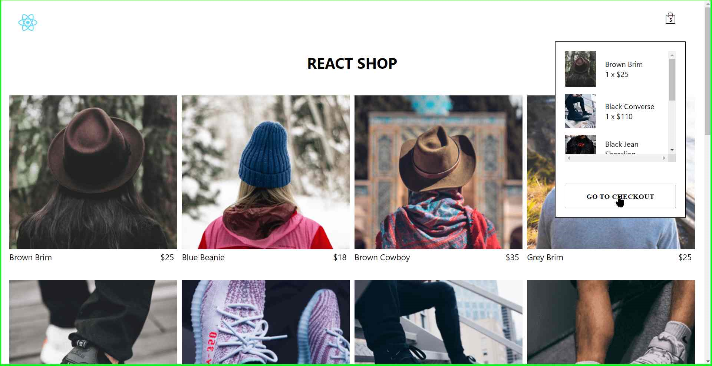

# Shopping Cart Project

Welcome to the Shopping Cart project! This is a React-based web application developed as part of my internship at ineuron.ai. The project aims to create an interactive shopping experience where users can add, increase, decrease, and remove items from their cart. It utilizes HTML, CSS, JavaScript, and React with the useContext hook for efficient state management.

## Features

- Add items to the shopping cart
- Increase or decrease the quantity of items in the cart
- Remove items from the cart
- User-friendly and responsive design
- Efficient state management using the useContext hook

## Installation

1. Clone the repository: `git clone https://github.com/PravarAnu/shopping-cart.git`
2. Navigate to the project directory: `cd shopping-cart`
3. Install the dependencies: `yarn install`

## Usage

1. Start the development server: `yarn start`
2. Open your browser and visit: `http://localhost:3000`

## Deployment

The Shopping Cart project is deployed on [Vercel](https://vercel.com). You can access the live version of the application at [https://shopping-cart.vercel.app](https://shopping-cart-ineuron.vercel.app/).

## Screenshots

Here are some screenshots of the Shopping Cart project:
### Homepage

### Adding Items to cart

### Added Items are shown in cart

### Going to Checkout Page

### Detailed description on Checkout Page

### If there is no item in the cart then checkout page looks like this

## Contact

If you have any questions or suggestions, feel free to reach out to me:

- Email: pravaranu6@gmail.com
- LinkedIn: [Pravar Anu](https://www.linkedin.com/in/pravaranu/)

Thank you for checking out the Shopping Cart project!